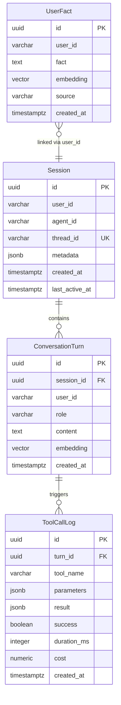

# Database Detailed Design

## 1. ER Diagram



---

## 2. Extensions Required

```sql
-- pgvector for vector column type and similarity operators
CREATE EXTENSION IF NOT EXISTS vector;

-- pgai for embedding generation and semantic search helpers
CREATE EXTENSION IF NOT EXISTS ai;

-- uuid-ossp for UUID generation
CREATE EXTENSION IF NOT EXISTS "uuid-ossp";
```

**Note:** The `timescale/timescaledb-ha:pg17` Docker image includes pgvector and pgai pre-installed.

---

## 3. Table Definitions

### E-02: Session (`sessions`)

Tracks conversation sessions. Each session maps to a LangGraph thread.

| Column | Type | Constraints | Description |
|--------|------|-------------|-------------|
| `id` | `uuid` | PK, DEFAULT uuid_generate_v4() | Unique session ID |
| `user_id` | `varchar(255)` | NOT NULL, INDEX | Sender/user identifier |
| `agent_id` | `varchar(255)` | NOT NULL, DEFAULT 'pro-agent' | Agent identifier |
| `thread_id` | `varchar(255)` | UNIQUE, NOT NULL | LangGraph thread ID (maps to session_id or conversation_id from API) |
| `metadata` | `jsonb` | DEFAULT '{}' | Extensible metadata (source, platform, etc.) |
| `created_at` | `timestamptz` | NOT NULL, DEFAULT now() | Session creation time |
| `last_active_at` | `timestamptz` | NOT NULL, DEFAULT now() | Last message time (updated on each turn) |

```sql
CREATE TABLE sessions (
    id              uuid PRIMARY KEY DEFAULT uuid_generate_v4(),
    user_id         varchar(255) NOT NULL,
    agent_id        varchar(255) NOT NULL DEFAULT 'pro-agent',
    thread_id       varchar(255) UNIQUE NOT NULL,
    metadata        jsonb NOT NULL DEFAULT '{}',
    created_at      timestamptz NOT NULL DEFAULT now(),
    last_active_at  timestamptz NOT NULL DEFAULT now()
);

CREATE INDEX idx_sessions_user_id ON sessions (user_id);
CREATE INDEX idx_sessions_last_active ON sessions (last_active_at DESC);
```

---

### E-01: ConversationTurn (`conversation_turns`)

Every message (user, assistant, tool) stored with its embedding for semantic search.

| Column | Type | Constraints | Description |
|--------|------|-------------|-------------|
| `id` | `uuid` | PK, DEFAULT uuid_generate_v4() | Unique turn ID |
| `session_id` | `uuid` | FK → sessions.id, NOT NULL | Parent session |
| `user_id` | `varchar(255)` | NOT NULL, INDEX | Sender identifier (denormalized for fast queries) |
| `role` | `varchar(20)` | NOT NULL, CHECK (role IN ('user', 'assistant', 'tool')) | Message role |
| `content` | `text` | NOT NULL | Message text content |
| `embedding` | `vector(1536)` | NULLABLE | Embedding vector (generated async or on insert) |
| `created_at` | `timestamptz` | NOT NULL, DEFAULT now() | Turn creation time |

```sql
CREATE TABLE conversation_turns (
    id          uuid PRIMARY KEY DEFAULT uuid_generate_v4(),
    session_id  uuid NOT NULL REFERENCES sessions(id) ON DELETE CASCADE,
    user_id     varchar(255) NOT NULL,
    role        varchar(20) NOT NULL CHECK (role IN ('user', 'assistant', 'tool')),
    content     text NOT NULL,
    embedding   vector(1536),
    created_at  timestamptz NOT NULL DEFAULT now()
);

CREATE INDEX idx_turns_session_id ON conversation_turns (session_id);
CREATE INDEX idx_turns_user_id ON conversation_turns (user_id);
CREATE INDEX idx_turns_created_at ON conversation_turns (created_at DESC);
```

**Vector index** (create after accumulating data — not needed for < 10k rows):

```sql
CREATE INDEX idx_turns_embedding ON conversation_turns
    USING ivfflat (embedding vector_cosine_ops)
    WITH (lists = 100);
```

---

### E-03: UserFact (`user_facts`)

Persistent facts about users, extracted from conversations. Enables "the agent remembers me" experience.

| Column | Type | Constraints | Description |
|--------|------|-------------|-------------|
| `id` | `uuid` | PK, DEFAULT uuid_generate_v4() | Unique fact ID |
| `user_id` | `varchar(255)` | NOT NULL, INDEX | User this fact belongs to |
| `fact` | `text` | NOT NULL | The fact text (e.g. "prefers Python over JS") |
| `embedding` | `vector(1536)` | NULLABLE | Embedding for semantic dedup and retrieval |
| `source` | `varchar(50)` | NOT NULL, DEFAULT 'chat' | How fact was learned: 'chat', 'tool', 'manual' |
| `created_at` | `timestamptz` | NOT NULL, DEFAULT now() | When fact was recorded |

```sql
CREATE TABLE user_facts (
    id          uuid PRIMARY KEY DEFAULT uuid_generate_v4(),
    user_id     varchar(255) NOT NULL,
    fact        text NOT NULL,
    embedding   vector(1536),
    source      varchar(50) NOT NULL DEFAULT 'chat',
    created_at  timestamptz NOT NULL DEFAULT now()
);

CREATE INDEX idx_facts_user_id ON user_facts (user_id);
```

---

### E-04: ToolCallLog (`tool_call_logs`)

Audit trail for every tool invocation. Used for debugging, cost tracking, and Langfuse correlation.

| Column | Type | Constraints | Description |
|--------|------|-------------|-------------|
| `id` | `uuid` | PK, DEFAULT uuid_generate_v4() | Unique log ID |
| `turn_id` | `uuid` | FK → conversation_turns.id, NOT NULL | Parent turn that triggered this tool call |
| `tool_name` | `varchar(100)` | NOT NULL, INDEX | Tool identifier (e.g. 'web_search', 'github') |
| `parameters` | `jsonb` | NOT NULL, DEFAULT '{}' | Tool input parameters |
| `result` | `jsonb` | NOT NULL, DEFAULT '{}' | Tool output (truncated if large) |
| `success` | `boolean` | NOT NULL | Whether tool call succeeded |
| `duration_ms` | `integer` | NOT NULL | Execution time in milliseconds |
| `cost` | `numeric(10,6)` | DEFAULT 0 | Estimated cost of this tool call (USD) |
| `created_at` | `timestamptz` | NOT NULL, DEFAULT now() | When tool was invoked |

```sql
CREATE TABLE tool_call_logs (
    id          uuid PRIMARY KEY DEFAULT uuid_generate_v4(),
    turn_id     uuid NOT NULL REFERENCES conversation_turns(id) ON DELETE CASCADE,
    tool_name   varchar(100) NOT NULL,
    parameters  jsonb NOT NULL DEFAULT '{}',
    result      jsonb NOT NULL DEFAULT '{}',
    success     boolean NOT NULL,
    duration_ms integer NOT NULL,
    cost        numeric(10,6) DEFAULT 0,
    created_at  timestamptz NOT NULL DEFAULT now()
);

CREATE INDEX idx_tool_logs_turn_id ON tool_call_logs (turn_id);
CREATE INDEX idx_tool_logs_tool_name ON tool_call_logs (tool_name);
CREATE INDEX idx_tool_logs_created_at ON tool_call_logs (created_at DESC);
```

---

## 4. Key Queries

### Semantic Search: Retrieve Relevant Past Turns (FR-06)

```sql
-- Given a new message embedding, find top-k similar past turns for this user
SELECT id, session_id, role, content, created_at,
       1 - (embedding <=> $1::vector) AS similarity
FROM conversation_turns
WHERE user_id = $2
  AND embedding IS NOT NULL
  AND 1 - (embedding <=> $1::vector) > $3  -- similarity_threshold (default 0.7)
ORDER BY embedding <=> $1::vector
LIMIT $4;  -- top_k_turns (default 10)
```

### Retrieve User Facts (FR-07)

```sql
-- Get facts about a user, optionally ranked by relevance to current message
SELECT id, fact, source, created_at,
       1 - (embedding <=> $1::vector) AS relevance
FROM user_facts
WHERE user_id = $2
  AND embedding IS NOT NULL
ORDER BY embedding <=> $1::vector
LIMIT $3;  -- top_k_facts (default 5)
```

### Store a Conversation Turn (FR-06)

```sql
-- Insert turn and return ID for tool call logging
INSERT INTO conversation_turns (session_id, user_id, role, content, embedding)
VALUES ($1, $2, $3, $4, $5::vector)
RETURNING id;
```

### Get or Create Session (FR-08)

```sql
-- Upsert session by thread_id
INSERT INTO sessions (user_id, agent_id, thread_id)
VALUES ($1, $2, $3)
ON CONFLICT (thread_id) DO UPDATE
    SET last_active_at = now()
RETURNING id;
```

### Memory Stats for Health Endpoint (FR-04)

```sql
SELECT
    (SELECT count(*) FROM conversation_turns) AS total_turns,
    (SELECT count(*) FROM sessions) AS total_sessions,
    (SELECT count(*) FROM user_facts) AS total_user_facts;
```

### Cost Aggregation (FR-17)

```sql
-- Total cost for a specific turn (all tool calls)
SELECT COALESCE(SUM(cost), 0) AS total_tool_cost
FROM tool_call_logs
WHERE turn_id = $1;

-- Daily cost summary
SELECT date_trunc('day', created_at) AS day,
       SUM(cost) AS total_cost,
       count(*) AS total_calls
FROM tool_call_logs
GROUP BY 1
ORDER BY 1 DESC
LIMIT 30;
```

---

## 5. Embedding Strategy

| Aspect | Choice | Rationale |
|--------|--------|-----------|
| **Default model** | OpenAI `text-embedding-3-small` (via LiteLLM) | 1536 dimensions, cheap ($0.02/M tokens), good quality |
| **Configurable** | Yes — set `EMBEDDING_MODEL`, `EMBEDDING_API_KEY`, `EMBEDDING_API_BASE` | Supports swapping providers without code changes (OpenAI → Ollama → HuggingFace, etc.) |
| **Dimension** | 1536 | Default for text-embedding-3-small (must match model if changed) |
| **When generated** | Synchronous on insert | Simplicity; async batch embedding deferred to Tier 3 |
| **What gets embedded** | User messages + assistant replies | Tool messages excluded (often structured/noisy) |
| **Similarity metric** | Cosine distance (`<=>` operator) | Standard for text embeddings |
| **Index type** | IVFFlat (after 10k+ rows) | Good recall/speed tradeoff, simpler than HNSW |
| **Fallback** | If embedding API fails, store turn with NULL embedding | Turn still stored, just not searchable |

---

## 6. Migration Strategy

**Init script:** `init.sql` runs on first `docker-compose up` via PostgreSQL init directory.

```
pro-agent/
└── db/
    └── init.sql    # Extensions + all CREATE TABLE statements
```

Mount in docker-compose:
```yaml
postgres:
  volumes:
    - ./db/init.sql:/docker-entrypoint-initdb.d/init.sql
    - pgdata:/home/postgres/pgdata/data
```

**Future migrations:** Use Alembic (SQLAlchemy) when schema evolves. Not needed for MVP — single init script is sufficient.

---

## 7. Traceability

| Entity | Table | SRD Entity | Features |
|--------|-------|------------|----------|
| Session | `sessions` | E-02 | FR-02, FR-03, FR-08 |
| ConversationTurn | `conversation_turns` | E-01 | FR-02, FR-03, FR-06 |
| UserFact | `user_facts` | E-03 | FR-07 |
| ToolCallLog | `tool_call_logs` | E-04 | FR-09–FR-14, FR-17 |
